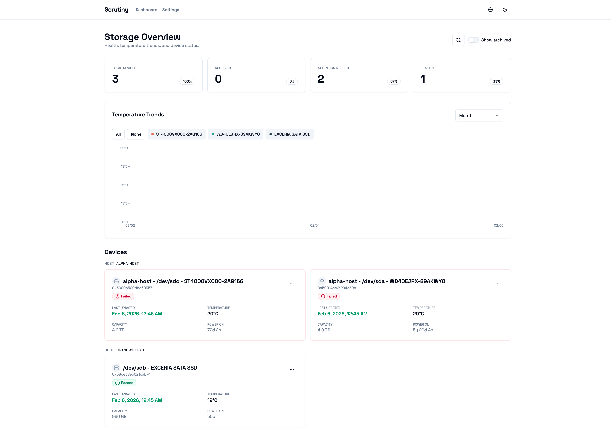
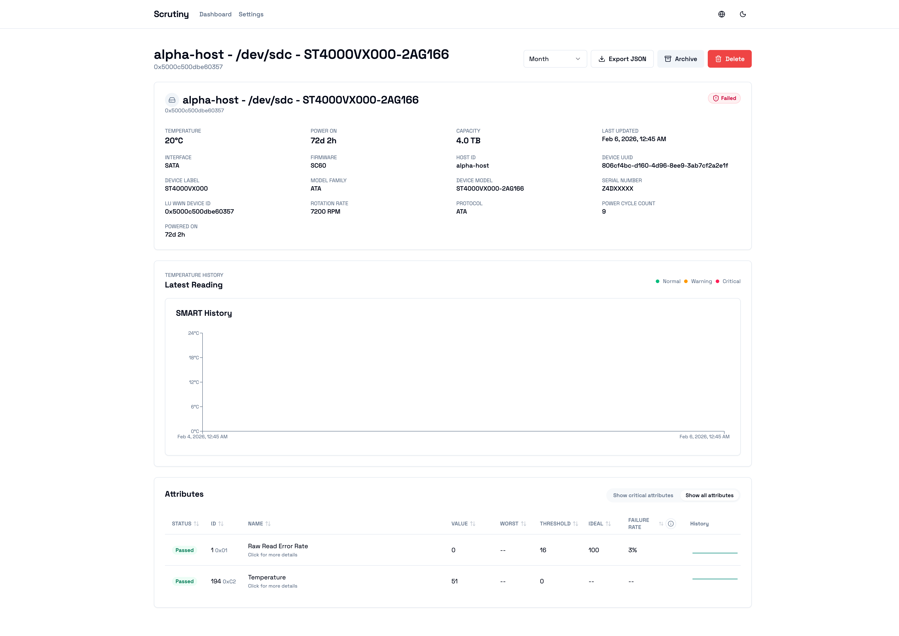
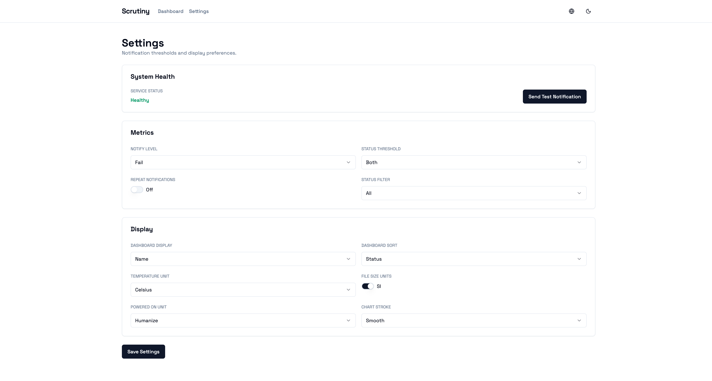

# Scrutiny UI

[](https://github.com/AlliotTech/scrutiny-ui/actions/workflows/ci-pages.yml)
[](https://github.com/AlliotTech/scrutiny-ui/releases)
[](LICENSE)

Standalone Scrutiny frontend built with Next.js (App Router), React, TypeScript, Tailwind, and shadcn/ui.

---
**Language:** English | [中文](README.zh-CN.md)
---

- Demo: https://alliottech.github.io/scrutiny-ui/
- Contributing: `CONTRIBUTING.md`

## Screenshots
<p float="left">
  
  
  
</p>

## Quickstart
```bash
pnpm install
pnpm dev
```
Open `http://localhost:3000`.

## Build
```bash
pnpm build
```
Static export output: `out/` (when `NEXT_OUTPUT=export`).

## Download (Release)
```bash
curl -L -o scrutiny-web-frontend.tar.gz https://github.com/AlliotTech/scrutiny-ui/releases/latest/download/scrutiny-web-frontend.tar.gz
tar -xzf scrutiny-web-frontend.tar.gz -C ./data/web
```

## Quick Replace Deploy
Ensure your `web` service mounts the static directory:
```yaml
services:
  web:
    image: 'ghcr.io/analogj/scrutiny:master-web'
    ports:
      - '8080:8080'
    volumes:
      - './data/config:/opt/scrutiny/config'
      - './data/web:/opt/scrutiny/web:ro' # <- mount static files here
    environment:
      SCRUTINY_WEB_INFLUXDB_HOST: 'influxdb'
    depends_on:
      influxdb:
        condition: service_healthy
    restart: always
    healthcheck:
      test: ["CMD", "curl", "-f", "http://localhost:8080/api/health"]
      interval: 5s
      timeout: 10s
      retries: 20
      start_period: 10s
```

Download and replace the static files:
```bash
curl -L -o scrutiny-web-frontend.tar.gz https://github.com/AlliotTech/scrutiny-ui/releases/latest/download/scrutiny-web-frontend.tar.gz
tar -xzf scrutiny-web-frontend.tar.gz -C ./data/web
```

## Routes
- Device detail uses a query param for static export: `/device?wwn=...`

## Environment
- `NEXT_PUBLIC_USE_MOCKS=true|false` enable MSW mocks (dev/demo)
- `NEXT_PUBLIC_BASE_PATH=/web` base path for `/web` deployments
- `NEXT_OUTPUT=export` enables static export to `out/`

## API
All requests are relative to the current origin:
- `GET /api/summary`
- `GET /api/summary/temp?duration_key=week|month|year|forever`
- `GET /api/device/:wwn/details?duration_key=...`
- `POST /api/device/:wwn/archive`
- `POST /api/device/:wwn/unarchive`
- `DELETE /api/device/:wwn`
- `GET /api/settings`
- `POST /api/settings`
- `GET /api/health`
- `POST /api/health/notify`

## Testing
```bash
pnpm test
pnpm test:ui
```

## Deploy
- GitHub Pages demo uses mock data and is built from `main`.
- Production static bundle is built from a release tag and targets `/web`.

## Project Structure
```
app/(dashboard)/page.tsx
app/device/page.tsx
app/settings/page.tsx
components/ui/*
components/dashboard/*
components/device/*
components/settings/*
lib/api.ts
lib/i18n/*
lib/types.ts
lib/format.ts
```

## Notes
- i18n is client-side only (no locale route prefixes). Language is stored in localStorage.
- If UI and backend are on different origins, configure backend CORS.
